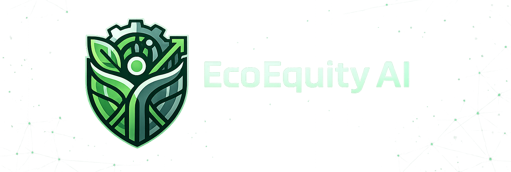

<div align="center">
  
  <h1>🌿 EcoEquity AI</h1>
  <p><strong>Advanced Urban Heat & Climate Intelligence Platform</strong></p>
  <p><em>Orchestrating satellite telemetry, AI synthesis, and community action to resolve urban thermal inequity.</em></p>

  <p>
    <a href="https://nextjs.org/"></a>
    <a href="https://www.typescriptlang.org/"></a>
    <a href="https://tailwindcss.com/"></a>
    <a href="https://supabase.com/"></a>
    <a href="https://deepmind.google/technologies/gemini/"></a>
    <a href="https://www.sentinel-hub.com/"></a>
  </p>
</div>

<br />

## 📖 Overview

**EcoEquity AI** is a cutting-edge environmental intelligence platform designed to combat the "Urban Heat Island" effect. By synthesizing real-time satellite telemetry with hyper-local user reports, the platform identifies thermal stress zones and facilitates direct community-led reforestation efforts.

Designed for the **EU-CODE WEEK Hackathon**, EcoEquity AI transforms complex Earth Observation data into actionable urban planning intelligence.

---

## ✨ Key Features & Real-Time Intelligence

### 📡 Sentinel-Enabled Satellite HUD
A premium aerospace-grade interface (`SentinelMap`) that provides direct access to **Sentinel Hub STAC** data.
- **Dynamic STAC Inspection:** Live metadata streams for Sentinel-2 collections.
- **Spectrum Analysis:** Real-time NDVI (Normalized Difference Vegetation Index) visualization using spectral bands.
- **Global Sector Status:** Command-center telemetry indicating elevation, atmospheric purity, and sector stability.

### 🗺️ Tactical Heat Mapping
An interactive GeoJSON-powered layer (`EcoMap`) rendering district-level vulnerability.
- **District Polygons:** Detailed spatial overlays with custom tooltips showing NDVI indices for every urban sector.
- **Spatial Focus Coordination:** Unified "Fly-to" logic that synchronizes specific coordinates between the community feed and satellite HUD.

### 🤖 Neural Core (AI Synthesis)
Integrated **Google Gemini Pro** engine for deep ecological narrative processing.
- **Automated District Analysis:** One-click synthesis of population density, vegetation health, and thermal stress.
- **Actionable Planning:** Provides specific, AI-generated reforestation protocols tailored to each district's unique data signature.

### 📍 Hyper-Local Telemetry & Geolocation
- **Unified Geolocation Sync:** Automatic, high-accuracy user location detection that synchronizes the entire platform's tactical views (Maps, Dashboard, AI).
- **Field Feed Engagement:** Real-time community reporting system where residents upload thermal stress observations directly into the global data stream.
- **Mitigation Request Protocol:** A streamlined system for requesting immediate canopy restoration in "Critical" zones.

---

## 🏗️ Technical Architecture

EcoEquity AI follows a modular, reactive architecture designed for high-performance geospatial rendering.

### 1. Global State & Context Hub
We utilize a unified **React Context + useReducer** architecture (`AppContext.tsx`) to manage the platform's "Neural Network." This enables real-time synchronization of:
- **Spatial Telemetry:** Active world coordinates and map zoom levels.
- **Tactical Focus:** Cross-component coordinate broadcast (e.g., clicking a report focuses the Satellite HUD).
- **Environmental State:** Global NDVI averages and thermal alert levels.

### 2. The Data Stack
| Layer | Technology | Role |
|-------|-----------|-------------|
| **Framework** | Next.js 14 | Orchestration of API routes and reactive client views. |
| **Mapping Engine** | Leaflet / React-Leaflet | High-performance spatial rendering of complex GeoJSON datasets. |
| **Motion/FX** | Framer Motion | Powers the "Glassmorphism" UI and fluid aerospace-grade transitions. |
| **Satellite Integration** | Sentinel Hub STAC API | Powers the deep-space telemetry and spectral data streams. |
| **AI Processing** | Google Gemini API | Synthesizes raw geospatial data into human-readable planning reports. |
| **Persistence** | Supabase | Real-time storage for community reports and reforestation requests. |

---

## 🚀 Deployment & Local Operations

### Prerequisites
- Node.js v18.17+
- API access keys for Google Gemini & Sentinel Hub.

### 1. Initialization
```bash
git clone https://github.com/your-org/eco-equity-ai.git
cd eco-equity-ai
npm install
```

### 2. Intelligence Link Configuration
Create `.env.local` and configure your uplinks:
```env
# AI Intelligence Key
NEXT_PUBLIC_GEMINI_API_KEY="your_key"

# Sentinel Hub Gateway (Required for Satellite HUD)
SENTINEL_CLIENT_ID="your_id"
SENTINEL_CLIENT_SECRET="your_secret"

# Persistence Gateway
NEXT_PUBLIC_SUPABASE_URL="your_url"
NEXT_PUBLIC_SUPABASE_ANON_KEY="your_key"
```

### 3. Launch Core Systems
```bash
npm run dev
```

---

## 🌍 Spatial Data Interpretation Baseline

The platform utilizes a scientific NDVI baseline to categorize urban health:

| Index | Category | Thermal Impact | Tactical Priority |
|:-----:|:---------|:---------------|:------------------|
| **< 0.2** | 🔴 Critical | Extreme Heat Island | **Immediate Reforestation** |
| **0.2 – 0.4**| 🟡 Moderate | Significant Thermal Stress | **Mitigation Planning** |
| **> 0.4** | 🟢 Optimal | Healthy Bio-Regulated Zone | **Active Preservation** |

---

## 📂 Intelligence Repository Structure

```text
src/
├── app/              # Tactical Routing & API Gateways
│   ├── api/sentinel/ # Satellite STAC proxy logic
│   └── debug/        # Deep-stream protocol inspectors
├── components/       
│   ├── maps/         # Spatial HUDs (SentinelMap, EcoMap)
│   └── ui/           # Intelligence Displays (Dashboard, AI Panel, Feed)
├── context/          # The Platform's Neural Core (Global State)
├── lib/              # Spectral Analysis & AI Logic
└── types/            # Protocol & Data Stream Definitions
```

---

<div align="center">
  <b>EcoEquity AI: Engineering a cooler, more equitable urban future through aerospace intelligence.</b>
</div>